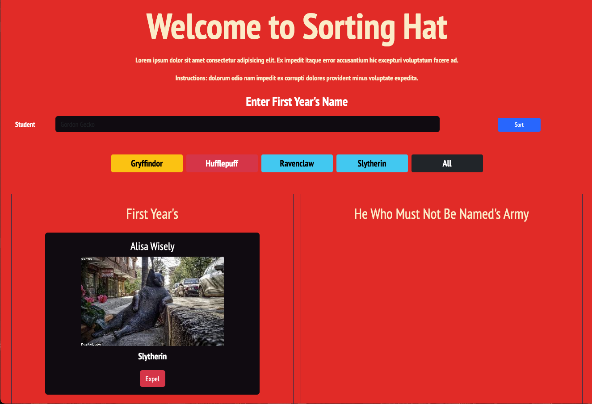
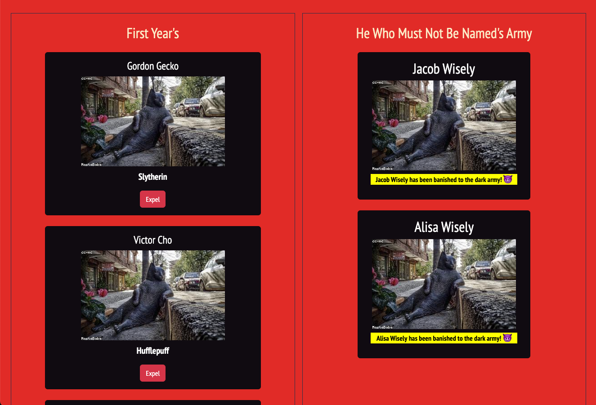

# This is the name of my Project  
<!-- update the netlify badge above with your own badge that you can find at netlify under settings/general#status-badges -->

Welcome to Sorting Hat! This project simply allows a user to enter a name using the provided form. Sorting Hat will automatically pick one of the four available houses and assign that house to the name the user enter. The page will reload the list of students that aren't expelled.

You can also expel a student which will render their card to the expelled students sections of the page.
[View App](#your-link)

## About the User <!-- This is a scaled down user persona -->
- The ideal user for this application is anyone that's a fan of the Harry Potter series and is interested in being assigned to one of the four houses!

## Features <!-- List your app features using bullets! Do NOT use a paragraph. No one will read that! -->
- Ability to add students to the DOM, expel (remove) students and render a Bootstrap card to the expelled section of the page.
- House Colors: The color of the student's card changes depending on which house they were sorted.
- Filtering: Show student cards by house name.
- Some animations made possible by the cross-browser library Animate.css.

## Relevant Links <!-- Link to all the things that are required outside of the ones that have their own section -->
- [Check out the deployed site](#your-link)
- [Wireframes](#your-link)

## Project Screenshots <!-- These can be inside of your project. Look at the repos from class and see how the images are included in the readme -->

## Contributors
- [YOUR NAME](https://github.com/gnashed)
